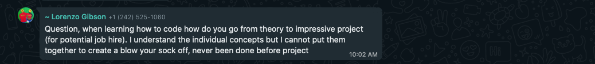
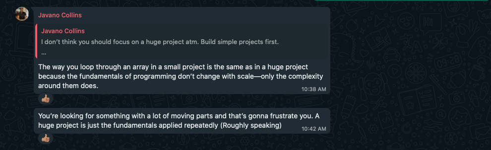

+++
date = '2025-02-05T11:00:20-05:00'
lastMod = '2025-02-05T11:00:20-05:00'
draft = false
title = "Horses From The Front (Dealing With Imposter Syndrome)"
description = "Imposter syndrome is something every developer faces—you're not alone. In this post, I share how a simple meme, 'Horses From the Front,' helped me realize that perfection isn’t the goal. It’s good enough to just start, and sometimes that’s all that matters."

[feature]
  image = "horses-from-the-front.jpg"
  alt= "Horses From The Front meme"
  figcaption = "Horses From The Front meme"

#Footnotes will be added based on this front matter. Shortcode for footnote reference in text: .

# [[footnotes]]
#   id = 1
#   content = ""

[params]
  hasTwic = true
  post = true
  categories = ['Random', 'Web Development']
  tags = ['imposter syndrome', 'web development', 'self-doubt', 'motivation', 'programming struggles', 'mental health in tech', 'developer mindset', 'overcoming imposter syndrome', 'personal growth', 'coding journey', 'software development', 'perfectionism']

+++

If you're a developer, you probably struggle with imposter syndrome. The question, "Am I good enough?" is always somewhere in the back of your mind.

Sometimes, you can feel alone because everyone else seems to be doing something "better" than you. But, all the while, they're battling the same demons.

This past weekend, I made a pitstop to Facebook (yes, I still use Facebook) and came across the "Horses From The Front" meme. It stuck out to me because, at the end of the day, for all the laughs and fun being made, someone still wanted it. That’s why we have it here, however many years—or centuries—later.

We could factor in the time period, saying the techniques were rudimentary and there wasn’t much to choose from, but the fact remains: someone chose it.

How does this tie into the conundrum of me facing my own fears and inadequacies? Well, let’s get into it.

## The Flash

I have a particular way about me.

My code is disorganized. My design? Clean. Simple. Minimal. I prioritize functionality and efficiency in my code, and I aim for a user experience that’s intuitive and unobtrusive.

I’m not flashy.

I had to come to terms with that about myself. But that’s just part and parcel of this process called life.

And it’s not just me—everyone has their own way of doing things and getting there. But can we accept it? Enter Exhibit A:

> Question, when learning how to code how do you go from theory to impressive project (for potential job hire). I understand the individual concepts but I cannot put them together to create a blow your sock off, never been done before project. 
{author="Lorenzo Gibson" source="Bahamas Tech Group"}

This idea of standing out—or not standing out, for that matter—gets to all of us. We doubt and question ourselves in light of others’ seemingly flawless efforts.

What’s worse, when we receive compliments on our work, we even doubt that. We tell ourselves, “Even our heroes are just saying that to be nice.”

We get stuck in wanting to build the next big thing and the disappointment that it never happens.

It’s diabolical work.

## Coming Down to Earth

In the end, we all need to be reminded of a simple fact: It’s the basics.

All the pressure we put on ourselves is totally meaningless. At the end of the day, whether your code is pretty or ugly, organized or disorganized, the question remains: does it work?

> The way you loop through an array in a small project is the same as in a huge project because the fundamentals of programming don’t change with scale—only the complexity around them does.
>
> You’re looking for something with a lot of moving parts and that’s gonna frustrate you. A huge project is just the fundamentals applied repeatedly (Roughly speaking)
{author="Javano Colllins" source="Bahamas Tech Group"}

Javano’s right. It’s the fundamentals that count because they’re what pop up every time.

Every line of code, every function, every program I write still relies on the basics. Applied in different ways, to a larger or smaller extent, but it remains the same.

If you can do it and it works, it’s good enough.

## And If It Doesn't

Right now, you’re probably asking, “How can I say that?” That brings us full circle to "Horses From The Front."

You have to start somewhere. Perfection is an ongoing practice, not a one-time event. If it doesn’t work, start again. Do it until it does.

If we didn’t start with the sad horses from the front, no one could have said something else might work better. The artist would never have improved, and, an even greater tragedy, we wouldn’t have it to laugh at today.

In programming, failure isn’t a sign of incompetence—it’s the foundation for growth.

## Get Some Help

All of this is easier said than done and it can be hard to come to terms, sometimes.

If you're stuck, get some help. Find fellow developers, mentors, and community members. These are the people that can help you through, provide valuable insight, and relevant feedback.

Getting involved with others who have been through the same struggles is a reminder that you're not alone in this journey.

## Someone Likes Your Horse From The Front

In the end, your horse from the front might be their horse from the side. And vice versa.

Just like in relationships, someone will find value in the work you've done.

Your horse is good enough. And so are you.

Happy coding!

